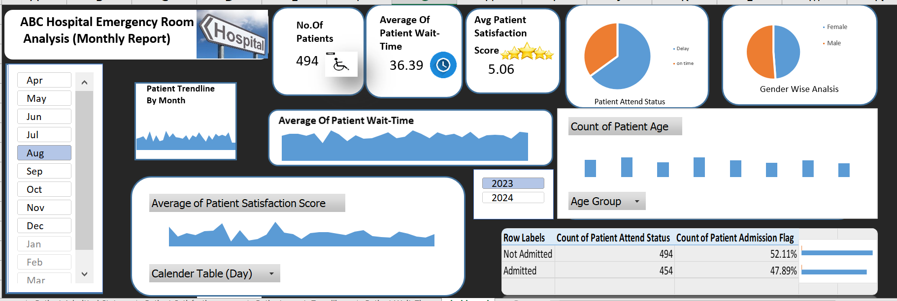
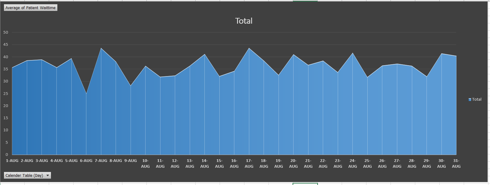
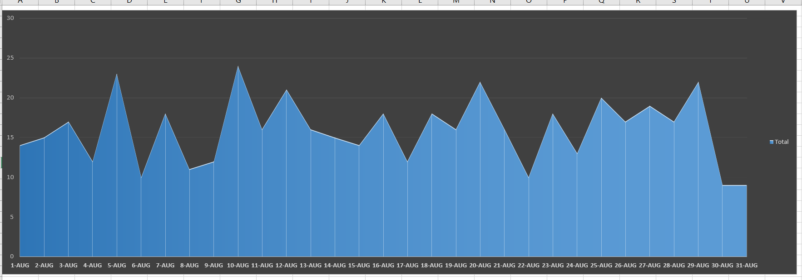
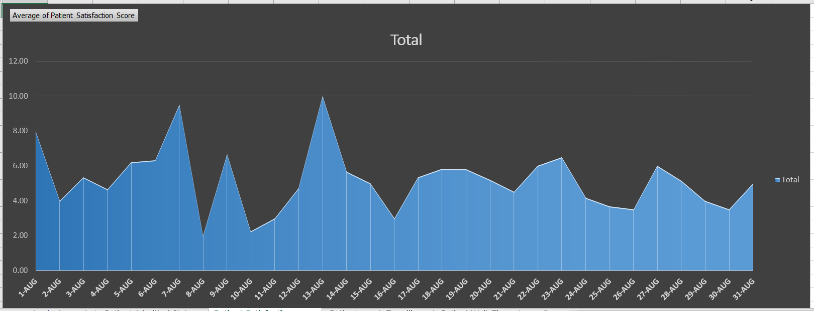
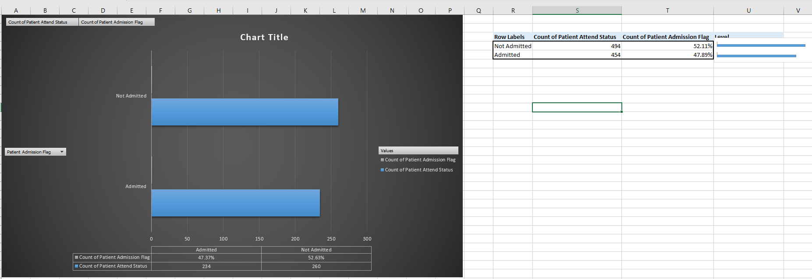
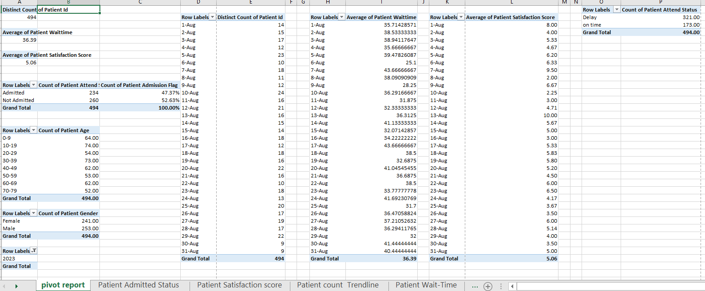

# 🏥 ABC Hospital Emergency Room Analysis  
### 📊 Interactive Excel Dashboard | Healthcare Data Analytics

---

## 📌 **Project Overview**

This project presents an interactive Excel dashboard developed to analyze Emergency Room (ER) patient data.  

The objective was to transform raw hospital data into meaningful KPIs and actionable insights to support operational efficiency, patient experience improvement, and data-driven decision-making.

---

## 🎯 **Problem Statement**

Hospitals require continuous monitoring of patient inflow, wait times, and service quality to optimize operations.  

This dashboard helps management:
- Track ER performance metrics
- Identify peak patient days
- Monitor satisfaction levels
- Analyze admission patterns
- Improve resource planning

---

## 📊 **Key Performance Indicators (KPIs)**

| KPI Metric | Value |
|------------|--------|
| 👥 Total Patients | 494 |
| ⏳ Average Patient Wait Time | 36.39 minutes |
| ⭐ Average Satisfaction Score | 5.06 |
| 🏥 Admission Rate | 47.89% |
| ❌ Non-Admission Rate | 52.11% |

---

## 📈 **Dashboard Capabilities**

- 📅 Daily Patient Volume Trend Analysis  
- ⏱ Average Wait Time Monitoring  
- 😊 Patient Satisfaction Tracking  
- 🏥 Admission vs Non-Admitted Comparison  
- 👶 Age Group Distribution  
- 🚻 Gender-Based Analysis  
- 🎛 Interactive Month & Year Slicers  
- 📊 Pivot-Based Summary Reporting  

---

## 🛠 **Tools & Techniques Used**

- Microsoft Excel  
- Power Query (Data Cleaning & Transformation)  
- Pivot Tables  
- Pivot Charts  
- KPI Cards  
- Slicers  
- Conditional Formatting  
- Trend Analysis  

---

# 📷 **Dashboard Visuals**

### 🔹 Main Dashboard Overview

---

### 🔹 Average Patient Wait Time Trend

---

### 🔹 Patient Count Trendline

---

### 🔹 Patient Satisfaction Trend

---

### 🔹 Admission Status Analysis

---

### 🔹 Pivot Report View

---

## 🔍 **Key Insights**

- Over 52% of ER visits did not result in admission, indicating a high number of non-critical cases.
- Wait times fluctuate between 25–44 minutes, suggesting opportunities for operational optimization.
- Patient satisfaction score (5.06) highlights moderate service levels with improvement potential.
- Certain days show significant spikes in patient inflow, useful for workforce planning.

---

## 🚀 **Skills Demonstrated**

✔ Data Cleaning & Preparation  
✔ KPI Development  
✔ Healthcare Data Analysis  
✔ Dashboard Design  
✔ Data Visualization  
✔ Business Insight Extraction  
✔ Analytical Thinking  

---

## 💼 **Business Impact**

This dashboard enables hospital management to:
- Monitor operational efficiency in real time  
- Improve patient experience through data insights  
- Optimize staffing and resource allocation  
- Support strategic decision-making  

---

### 📌 Author
Simran | PGDM – Data Science & Business Analytics  
Aspiring Data Analyst | Passionate about transforming data into insights
